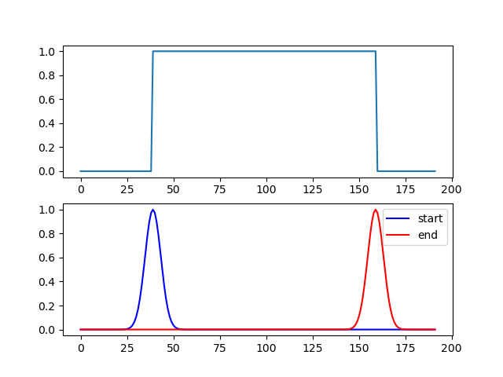
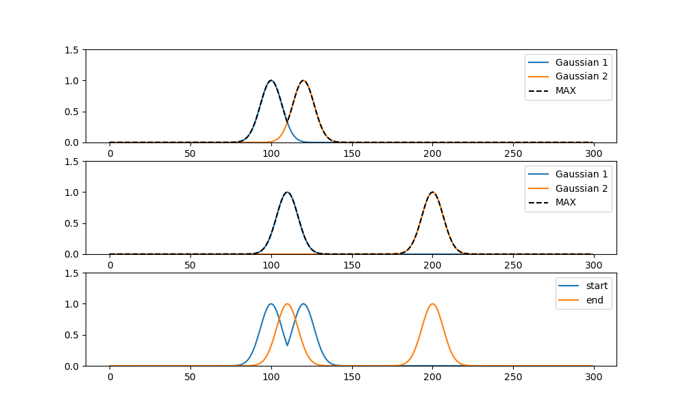

In the action detection task, we encode the start time and end time with Gaussian-like heatmaps. The values of the heatmaps represent the action occurring probability.

we encoder the time of the action start moment (ts) and action end moment (te) using the following equaction:
$$
t_{s} \mapsto h s\left(t ; t_{s}\right)=e^{\frac{-\left(t-t_{s}\right)^{2}}{2 \sigma^{2}}}, t=1,2,3, \ldots, n
$$


Moreover, the action may take place multiple (m) times, n this situation, we first encoder every action start moment to obtain m action start heatmaps. Then we fuse all start heatmaps using the following equation:
$$
h s(t)=\max _{i=1,2, \ldots, m} h s\left(t ; t_{s}^{i}\right)
$$


we take the maximum of the heatmaps to fuse.

```python
# --------- test label ----------------------------------------
test_label_len = 300
test_label = np.array([[100, 110], [120, 200]])

# --------- get gaussian label --------------------------------
gaussian_label = label_encoding_gaussian(test_label, test_label_len)
```


